# Software Visualizaton

### 구성
#### 설치시 용량: 약 10G

```
- CentOS7
- php
- apache
- tomcat
- redmine
- jenkins
- Subversion
- MySQL
- ruby
- rubygems
- Graphviz
- SourceNavigator.....
```
### 디렉토리 구조
**SWV**
- dev
  - ruby
  - rubygems
- htdocs
  - redmine(web file)
- server
  - apache
  - tomcat
  - mysql
  - svn
- webapps
  - jenkins
- toolchain
  - SNavi
  - graphviz
- tools
  - redmine(config file)

**설치는 root 계정으로 진행 하였음**

---------------------------------------
# USB Install
## 1. CentOS7 OS 초기 설치
### 언어설정  

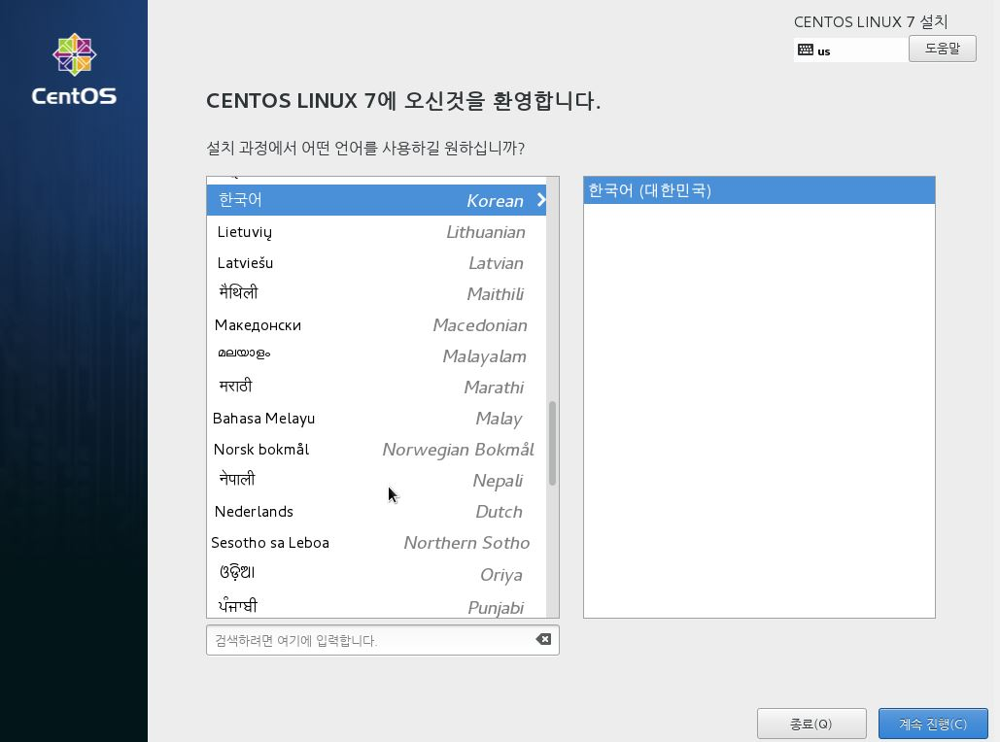
한국어로 설정
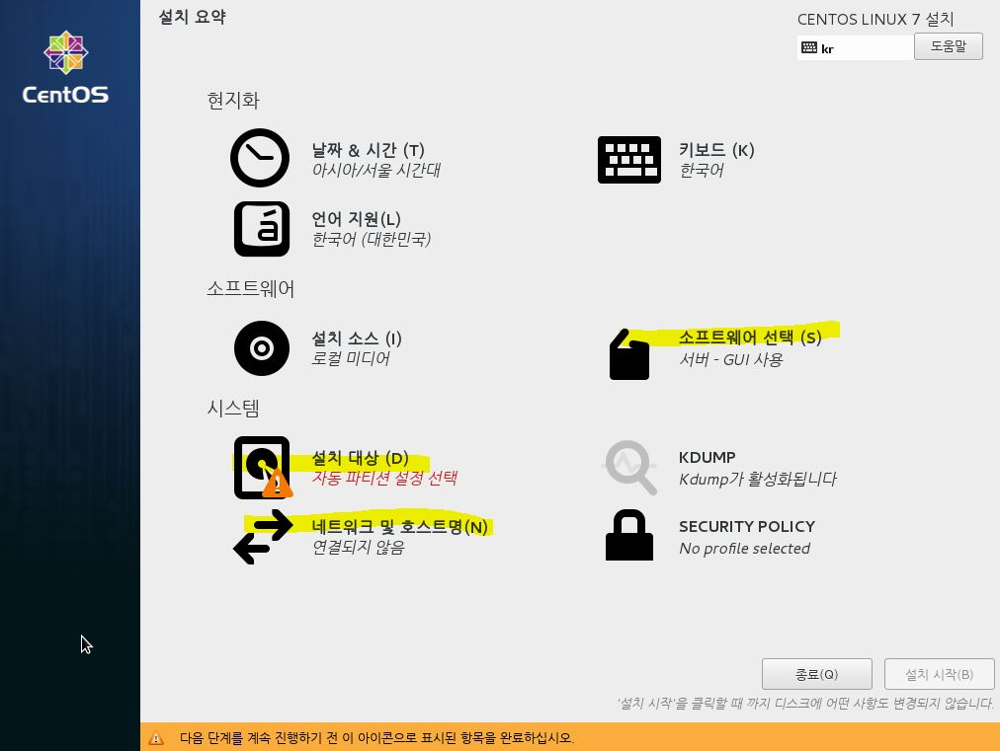  

 아래 3가지를 설정한다.
- 소프트웨어 선택
- 설치 대상
- 네트워크 및 호스트명

**소트프웨어 선택**  

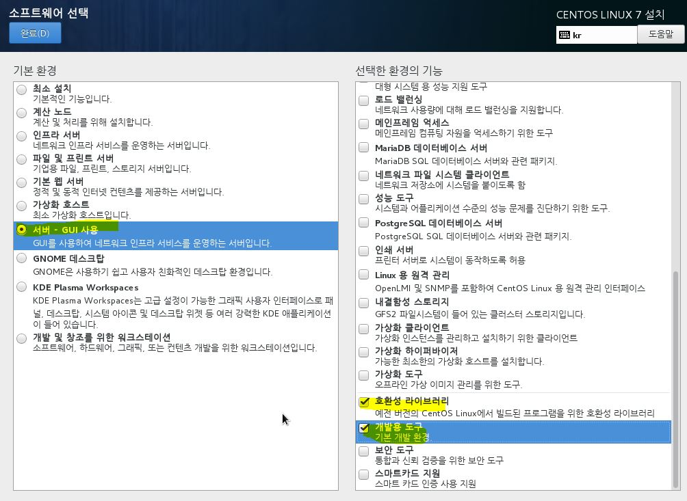

**설치 대상**
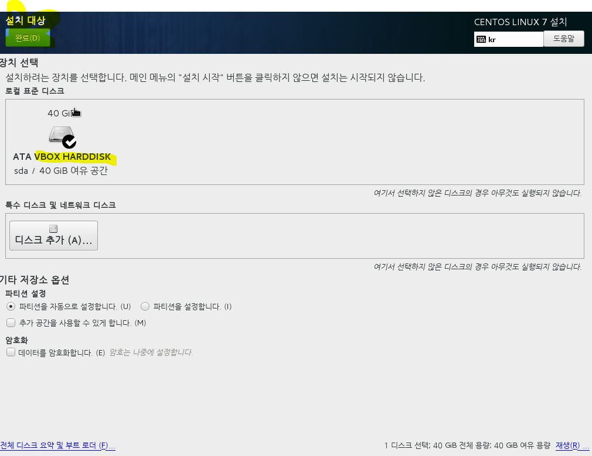   

 vm환경에서 테스트 작업한 것이라 따로 파티션 설정을 하진 않았습니다.  

**네트워크 및 호스트명**

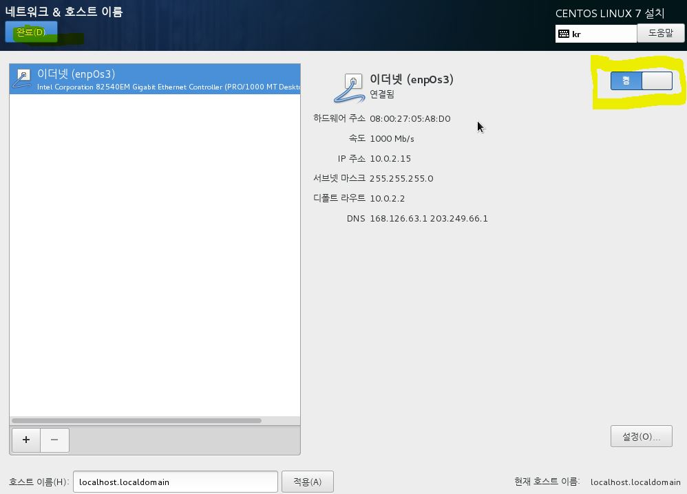

이더넷 연결을 켬으로 바꾸어 줍니다.  
설치 시작을 누르면 사용자 설정으로 넘어갑니다.


 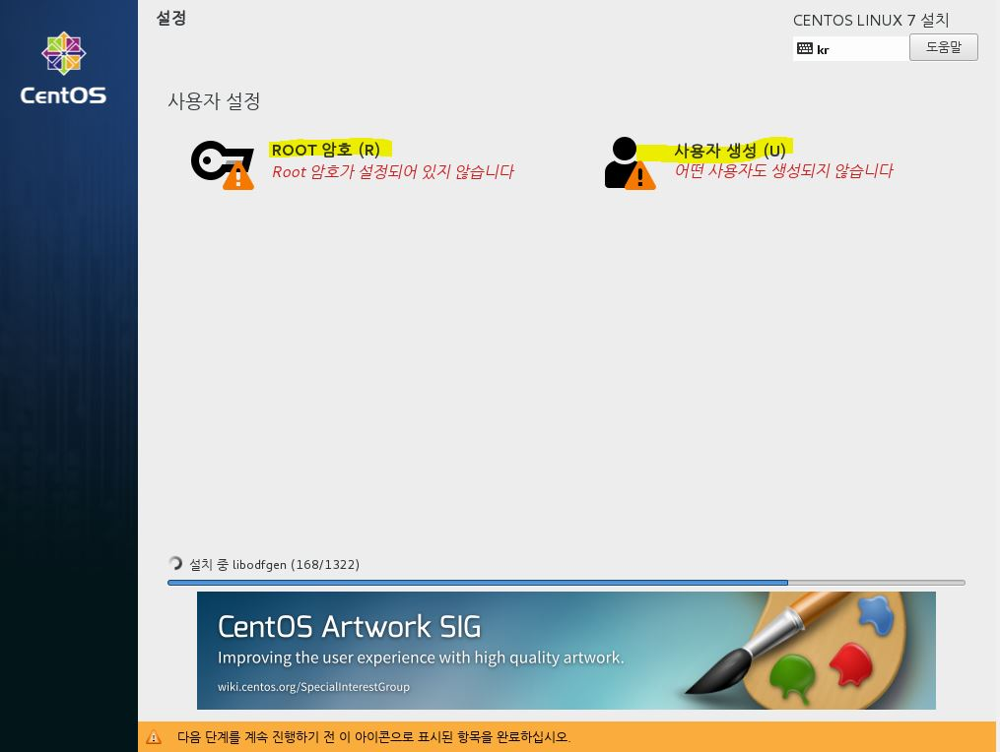

 OS가 설치되는 중에 root 암호와, 사용자를 생성하며 완료 후 재부팅을 합니다.  

 재부팅이 되면 라이센스 동의 목록을 체크한 후 os 설정을 완료합니다.
# 2. USB 설치
SWVpack.tar.gz를 사용하여 설치.  
usb파일 옮기기
```sh
fdisk -l #인식된 usb를 리스트로 보여준다 예) /dev/sda1
mkdir /tmp/usb #usb를 마운트할 폴더를 만든다
mount /dev/sda1 /tmp/usb #만든 폴더에 마운트하기
## 사용이 끝났을경우
umount /dev/sda1 #언마운트 하기
```
**usb 마운트 한 폴더 안의  SWVpack.tar.gz 를 `/usr/local` 경로에 옮깁니다.**


- (참고)CentOS7 기본 OpenSSL의 버전은 1.0.1 입니다. init.sh 파일을 실행하면 1.0.2 버전으로 업데이트가 됩니다.
- (참고)초기에는 보안모듈인 SELinux가 켜져있습니다. init.sh 파일을 실행하면 SELinux를 끄게 됩니다.
- (참고)CentOS7 기본으로 설치되는 Java를 제거합니다.

```sh
mv /tmp/usb/SWVpack.tar.gz /usr/local #file 옮기기
tar zxvpf SWVpack.tar.gz #압축 해제  ->SWVpack 폴더가 생긴다.
cd SWVpack #SWVpack으로 이동
./init.sh #파일 실행 -> /usr/local/SWV 폴더 생성
```

#### [mysql의 root 비밀번호를 설정해주어야 합니다.]
# Start

SWV폴더안에 start.sh 파일 실행으로 apache, mysql, tomcat 을 구동합니다.
```sh
cd /usr/local/SWV/ #SWV 폴더로 이동
./start.sh  # 구동시키기
```
- (참고)Java 관련 에러가 난다면, `source /etc/profile`을 하여 환경변수를 다시 적용합니다.

# Jenkins 실행

 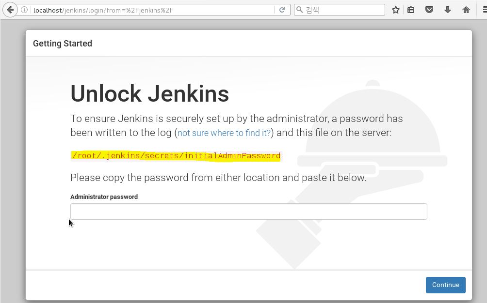
 localhost/jenkins로 접속을 하면 초기에 걸린 Lock을 풀어주기 위해 위에서 나오는 파일의 내용을 넣어줘야 합니다.
 ```sh
 cat /root/.jenkins/secrets/initialAdminPassword  #나오는 비밀번호를 복사하여 넣습니다.
 ```

 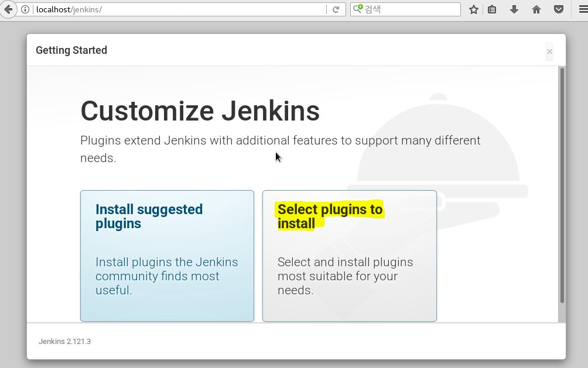
인터넷 환경이 아니기때문에, `Select plugins to install`을 선택하여 다음 단계로 넘어갑니다.

 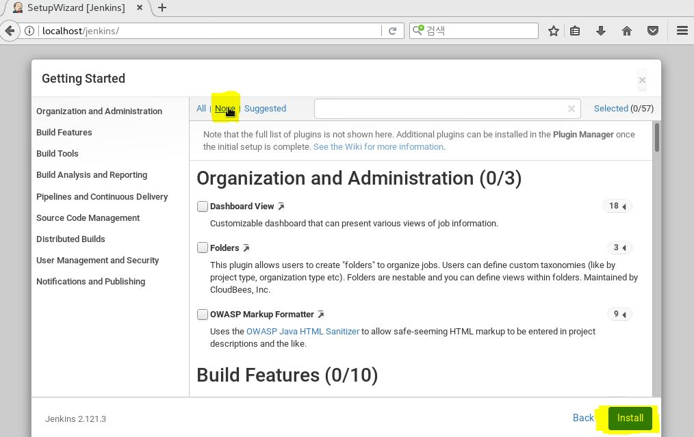
 `None`을 선택하여 어떠한 플러그인도 설치 하지 않는 것으로 진행합니다.
 `플러그인은 아래에 언급된 (주의)최초 설치 후 과정에서 가져옵니다.`

 
  첫 관리자 계정을 만드는 화면입니다. 폼에 맞게 내용을 적어주어 만들고, 계속 다음 단계로 넘어가 설치를 완료합니다.
 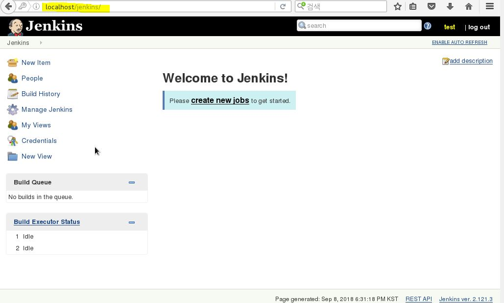
전에 만든 관리자 계정을 통해 로그인 한 후, 정상 작동하는 화면을 볼 수 있습니다.

**(주의) Jenkins 최초 설치 후 과정**
SWV폴더 안의 `start.sh` 파일로 최초 실행 하여 **jenskins 설정과, 계정 생성 과정을 다 마친 경우** `stop.sh` 로 종료 한 후,  `jenkins_plugins.sh` 를  한 번 실행해 주어야 합니다.  

# Redmine 실행
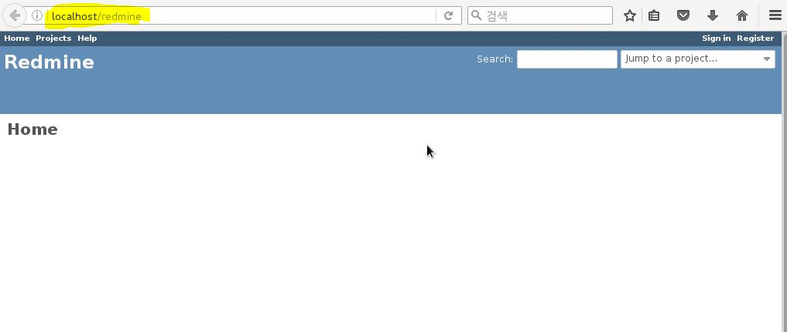
localhost/redmine으로 접속하여 redmine을 사용 가능합니다.

# SVN 계정 설정
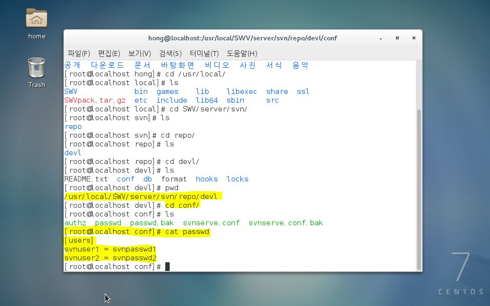

svn 저장소는 `/usr/local/server/svn/repo/devl`에 위치시켰습니다.
svn을 사용하는 계정, 권한에 관한 설정은 `/usr/local/server/svn/repo/devl/conf/` 폴더 안에 파일들의 내용을 변경하면 됩니다.  
passwd 파일 안에서 사용자의 계정과 비밀번호를 설정합니다.
```
예시)
[users]
ID = passwd
ID2 = passwd2
```

# Stop

SWV폴더안에 stop.sh 파일 실행으로 apache, mysql, tomcat 을 종료합니다.
