# Software Visualization Environment Install Guide for Linux

## Getting Started

- 이 문서는 리눅스 OS에 SWV 환경을 설치하기 위한 가이드입니다.
- 웹 상에서 도구를 다운로드 받아 설치하기 때문에, 인터넷 연결이 필요합니다.
- 가이드 내에서 소개되는 도구들의 다운로드 경로는 해당 사이트의 정책 상의 이유로 바뀔 수 있습니다. 도구의 다운로드가 실패한다면, 별첨을 참조하여 경로를 변경하십시오.

### Prerequisites
```
CentOS 7 이상의 리눅스 OS
```
CentOS 7 설치 방법 : https://github.com/moasoftware/swv/edit/master/README_os.md
### Installing

1. SWV 환경 구축을 위한 기본 디렉터리 생성
- 여섯 개의 디렉터리를 생성
```
# mkdir /usr/local/SWV
# mkdir /usr/local/SWV/dev
# mkdir /usr/local/SWV/tools
# mkdir /usr/local/SWV/server
# mkdir /usr/local/SWV/src
# mkdir /usr/local/SWV/toolchain
```


2. Apache HTTP 서버 설치
- yum을 이용해 관련된 유틸리티 설치
```
# yum -y install gcc make gcc-c++ pcre-devel httpd-devel apr-devel apr-util-devel
# yum -y install expat-devel
```
- wget을 이용해 관련된 유틸리티 다운로드 및 설치
```
# cd /usr/local/SWV/server
# wget http://archive.apache.org/dist/httpd/httpd-2.4.29.tar.gz
# wget http://mirror.apache-kr.org/apr/apr-1.6.5.tar.gz
# wget http://mirror.apache-kr.org/apr/apr-util-1.6.1.tar.gz
# wget http://downloads.sourceforge.net/project/pcre/pcre/8.41/pcre-8.41.tar.gz
# tar -xvzf httpd-2.4.29.tar.gz
# tar -xzvf apr-1.6.5.tar.gz
# tar -xzvf apr-util-1.6.1.tar.gz
# tar -xzvf pcre-8.41.tar.gz
# mv apr-1.6.5 ./httpd-2.4.29/srclib/apr
# mv apr-util-1.6.1 ./httpd-2.4.29/srclib/apr-util
# cd pcre-8.41
# ./configure
# make
# make install
```
- httpd 설치
```
# cd /usr/local/SWV/server/httpd-2.4.29
# ./configure --prefix=/usr/local/SWV/server/httpd
# make
# make install
# mv /usr/local/SWV/server/httpd/htdocs /usr/local/SWV/
```
- 웹서버 환경 설정 파일 열기
```
# ln /usr/local/SWV/server/httpd/bin/httpd /bin/httpd
# vim /usr/local/SWV/server/httpd/conf/httpd.conf
```
- httpd.conf의 내용을 다음과 같이 수정
```
변경 전: DocumentRoot “/usr/local/SWV/server/httpd/htdocs”
변경 후: <Directory “/usr/local/SWV/htdocs”>
```
```
변경 전: <Directory “/usr/local/SWV/server/httpd/htdocs”>
변경 후: <Directory “/usr/local/SWV/htdocs”>
```
```
변경 전: # ServerName www.example.com:80
변경 후: ServerName localhost:80
```
- 웹서버 실행
```
# /usr/local/SWV/server/httpd/bin/httpd -k start
```
- 웹브라우저를 이용하여 웹서버 실행 확인(http://localhost 경로로 접근)

- 80번 포트의 방화벽 해제
```
# firewall-cmd --permanent --zone=public --add-port=80/tcp
# firewall-cmd --reload
```


3. JDK 설치(설치가 안 될 경우 별첨 2를 참조하여 링크를 수정)
- 기존 JDK 환경설정이 존재한다면, 삭제 후 SWV의 JDK로 변경
```
# cd /usr/local/SWV/dev
# mkdir java
# cd java
# wget --no-cookies --header "Cookie: gpw_e24=xxx; oraclelicense=accept-securebackup-cookie;" "http://download.oracle.com/otn-pub/java/jdk/8u191-b12/2787e4a523244c269598db4e85c51e0c/jdk-8u191-linux-x64.rpm"
# yum -y remove copy-jdk-*
# rpm -ivh --prefix=/usr/local/SWV/dev/java jdk-8u191-linux-x64.rpm
# mv /usr/local/SWV/dev/java/jdk1.8.0_191-amd64 /usr/local/SWV/dev/java/jdk1.8.0_191
# rm -rf /usr/bin/java
# ln -s /usr/local/SWV/dev/java/jdk1.8.0_191/bin/java /usr/bin/java
```
- JDK 환경변수등록을 위해 profile 파일 열기
```
# vim /etc/profile
```
- 파일의 마지막 줄에 다음 코드 추가
```
JAVA_HOME=/usr/local/SWV/dev/java/jdk1.8.0_191
JRE_HOME=/usr/local/SWV/dev/java/jdk1.8.0_191/jre
CLASSPATH=.:$JAVA_HOME/lib/tools.jar
PATH=$PATH:$JAVA_HOME/bin
export JAVA_HOME CLASSPATH PATH
```
- profile 재등록
```
# source /etc/profile
```


4. Apache Tomcat 서버 설치
- Tomcat 다운로드 후 압축해제
```
# cd /usr/local/SWV/server
# wget http://apache.mirror.cdnetworks.com/tomcat/tomcat-8/v8.5.34/bin/apache-tomcat-8.5.34.tar.gz
# tar -xzvf apache-tomcat-8.5.34.tar.gz
# ln -s /usr/local/SWV/server/apache-tomcat-8.5.34/ tomcat
```
- Tomcat 정보 등록을 위해 profile 파일 열기
```
# vim /etc/profile
```
- 아래와 같이 기존 코드를 수정
```
JAVA_HOME=/usr/local/SWV/dev/java/jdk1.8.0_191
JRE_HOME=/usr/local/SWV/dev/java/jdk1.8.0_191/jre
CATALINA_HOME=/usr/local/SWV/server/tomcat
CLASSPATH=.:$JAVA_HOME/lib/tools.jar:$CATALINA_HOME/lib/jsp-api.jar:$CATALINA_HOME/lib/servlet-api.jar
PATH=$PATH:$JAVA_HOME/bin:$CATALINA_HOME/bin
export JAVA_HOME CLASSPATH PATH CATALINA_HOME JRE_HOME
```
- profile 재등록
```
# source /etc/profile
```
- Tomcat 서버의 홈디렉터리 변경을 위해 server.xml 파일 열기
```
# vim /usr/local/SWV/server/tomcat/conf/server.xml
```
- 다음과 같이 코드를 수정
```
변경 전:	<Host name="localhost" appBase="webapps" unpackWARs="true" autoDeploy="true" >
변경 후:	<Host name="localhost" appBase="/usr/local/SWV/webapps" unpackWARs="true" autoDeploy="true" xmlValidation="false" xmlNamespaceAware="false">
```
- 홈디렉터리를 /usr/local/SWV/로 이동
```
# mv /usr/local/SWV/server/tomcat/webapps /usr/local/SWV/
```
- Tomcat 서버 실행
```
# /usr/local/SWV/server/tomcat/bin/startup.sh
```
- 웹브라우저를 이용하여 Tomcat서버 실행 확인(http://localhost:8080 경로로 접근)

- 8080포트의 방화벽 해제
```
# firewall-cmd --permanent --zone=public --add-port=8080/tcp
# firewall-cmd --reload
```


5. Apache Tomcat Connector 설치
- Tomcat Connect 다운로드 후 설치
```
# cd /usr/local/SWV/server
# wget http://archive.apache.org/dist/tomcat/tomcat-connectors/jk/tomcat-connectors-1.2.42-src.tar.gz
# tar -xzvf tomcat-connectors-1.2.42-src.tar.gz
# ln -s tomcat-connectors-1.2.42-src/ connector
# cd connector/native
# chmod +x buildconf.sh
# ./configure --with-apxs=/usr/local/SWV/server/httpd/bin/apxs && make && make install
# cp apache-2.0/mod_jk.so /usr/local/SWV/server/httpd/modules/
[cp: overwrite ‘/usr/local/SWV/server/httpd/modules/mod_jk.so’ ? y]
```
- Apache 설정 수정을 위해 httpd.conf 파일 열기
```
# vim /usr/local/SWV/server/httpd/conf/httpd.conf
```
- LoadModule들이 설정된 곳에 다음 코드 추가(현재 문서 버전에서는 153라인에 해당)
```
LoadModule jk_module modules/mod_jk.so
```
- 마지막 줄에 다음 코드 추가
```
<VirtualHost *:80>
ServerName localhost
JkMount /*.jsp tomcat
JkMount /*.json tomcat
JkMount /*.xml tomcat
JkMount /*.do tomcat
</VirtualHost>
<IfModule mod_jk.c>
JkWorkersFile conf/workers.properties
JkShmFile run/mod_jk.shm
JkLogFile logs/mod_jk.log
JkLogLevel info
JkLogStampFormat "[%y %m %d %H:%M:%S] "
</IfModule>
```
- Tomcat Worker 설정 관련 디렉터리 생성 후 workers.properties 파일 생성
```
# mkdir /usr/local/SWV/server/httpd/run
# chcon -u system_u -r object_r -t httpd_modules_t /usr/local/SWV/server/httpd/modules/mod_jk.so
# vim /usr/local/SWV/server/httpd/conf/workers.properties
```
- workers.properties 파일에 다음 코드 추가
```
worker.list=tomcat
worker.tomcat.port=8009
worker.tomcat.host=localhost
worker.tomcat.type=ajp13
worker.tomcat.lbfactor=1
```
- 웹서버(HTTP & Tomcat) 재시작
```
# /bin/httpd -k restart
# /usr/local/SWV/server/tomcat/bin/shutdown.sh
# /usr/local/SWV/server/tomcat/bin/startup.sh
```


6. Jenkins 설치
- Jenkins 파일을 Tomcat 서버 디렉터리에 다운로드
```
# cd /usr/local/SWV/webapps
# wget http://mirrors.jenkins.io/war-stable/latest/jenkins.war
```
- HTTP 서버 설정 변경을 위해 httpd.conf 파일 열기
```
# vim /usr/local/SWV/server/httpd/conf/httpd.conf
```
- 아래와 같이 코드를 수정
```
변경 전:
<VirtualHost *:80>
ServerName localhost
JkMount /*.jsp tomcat
JkMount /*.json tomcat
JkMount /*.xml tomcat
JkMount /*.do tomcat
</VirtualHost>

변경 후:
<VirtualHost *:80>
ServerName localhost
JkMount /*.jsp tomcat
JkMount /*.json tomcat
JkMount /*.xml tomcat
JkMount /*.do tomcat
ProxyPass /jenkins http://127.0.0.1:8080/jenkins
ProxyPassReverse /jenkins http://127.0.0.1:8080/jenkins
</VirtualHost>
```
```
변경 전: #LoadModule proxy_module modules/mod_proxy.so
변경 후: LoadModule proxy_module modules/mod_proxy.so
```
```
변경 전: #LoadModule proxy_connect_module modules/mod_proxy_connect.so
변경 후: LoadModule proxy_connect_module modules/mod_proxy_connect.so
```
```
변경 전: #LoadModule proxy_http_module modules/mod_proxy_http.so
변경 후: LoadModule proxy_http_module modules/mod_proxy_http.so
```
```
변경 전: #LoadModule proxy_ajp_module modules/mod_proxy_ajp.so
변경 후: LoadModule proxy_ajp_module modules/mod_proxy_ajp.so
```
- Tomcat 서버 설정 변경을 위해 server.xml 파일 열기
```
# vim /usr/local/SWV/server/tomcat/conf/server.xml
```
- 아래와 같이 코드를 수정
```
변경 전:
<Host name="localhost appBase="/usr/local/SWV/webapps" unpackWARs="true" autoDeploy="true" xmlValidation="false" xmlNamespaceAware="false">

변경 후:
<Host name="localhost" appBase="/usr/local/SWV/webapps" unpackWARs="true" autoDeploy="true" xmlValidation="false" xmlNamespaceAware="false">
<Context path="" docBase="." reloadable="true"/>
```
- 웹서버(HTTP & Tomcat) 재부팅
```
# /bin/httpd -k restart
# /usr/local/SWV/server/tomcat/bin/shutdown.sh
# /usr/local/SWV/server/tomcat/bin/startup.sh
```
- 웹브라우저를 이용해 Jenkins 실행 확인(http://localhost/jenkins 경로로 접근)
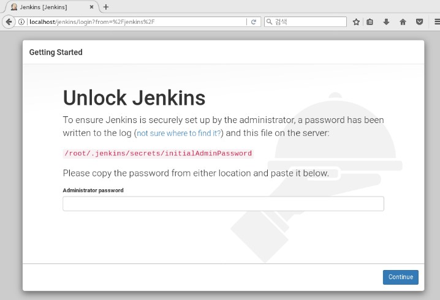
- Jenkins 패스워드 조회를 위해 initialAdminPassword 파일의 내용을 출력하여 드래그 후 Ctrl+C로 복사 (아래에 출력된 패스워드는 예시이므로 반드시 실제 출력되는 패스워드를 복사해야 함)
```
# cat /root/.jenkins/secrets/initialAdminPassword
59b4fbffdf704909bb37cbe085a31833
```
- 웹브라우저의 암호 입력칸에 복사된 패스워드를 입력
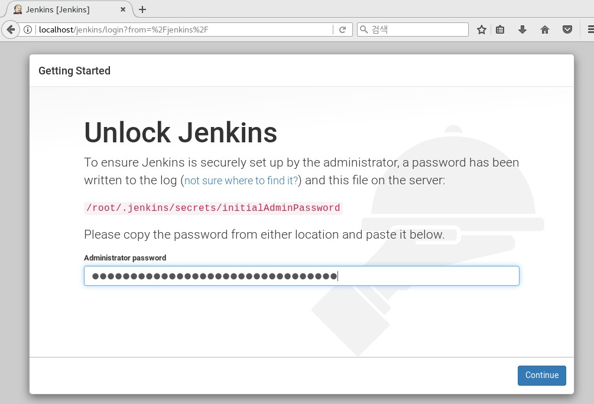
- Install suggested plugins 선택
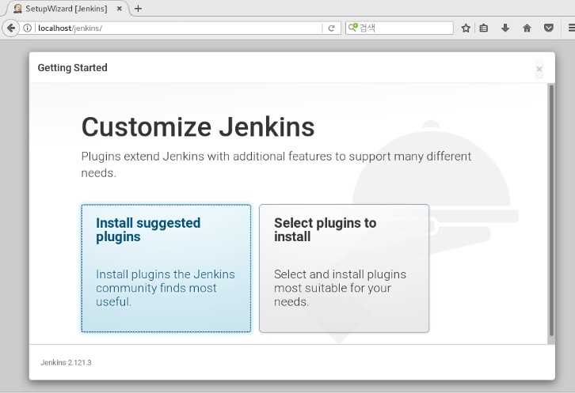
- 세팅이 완료될 때까지 기다린 후 Continue 버튼 클릭
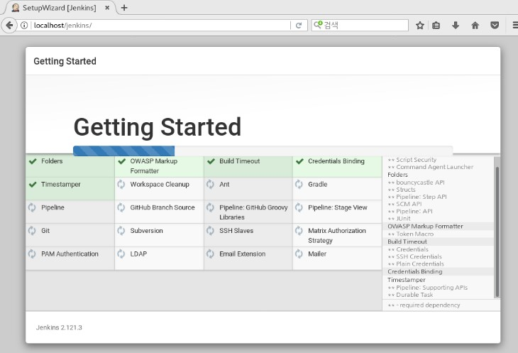
- 계정 정보 입력(본 문서에서는 id: admin, pw: ssssssss)
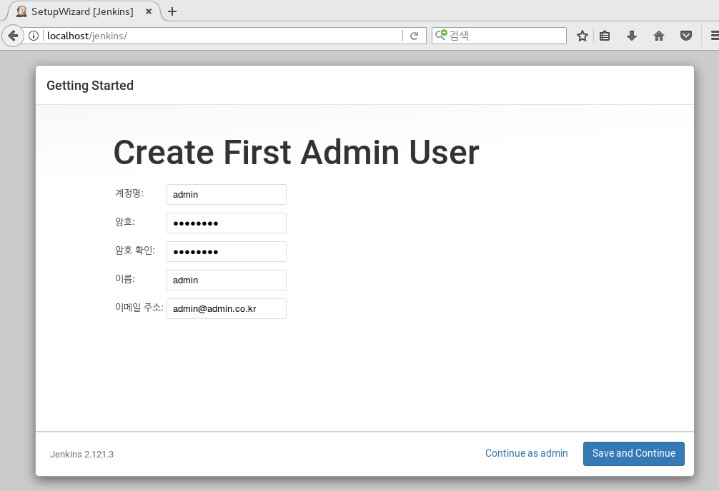
- save and finish 선택

- Start using Jenkins 선택
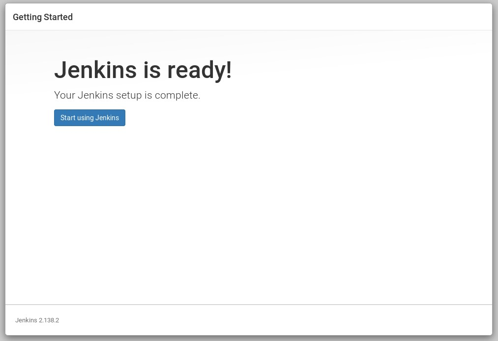
- 앞서 설정한 아이디와 암호 입력하여 로그인

- Jenkins is ready! 페이지 이후 흰색 페이지만 보인다면, Tomcat 서버 재시작
```
# /usr/local/SWV/server/tomcat/bin/shutdown.sh
# /usr/local/SWV/server/tomcat/bin/startup.sh
```


7. MySQL 설치
- mysql 사용자 아이디 추가
```
# cd /usr/local/SWV/server
# useradd mysql
```
- 관련 파일 다운로드 후 압축 해제
```
# wget https://dev.mysql.com/get/Downloads/MySQL-5.7/mysql-5.7.22.tar.gz
# wget https://sourceforge.net/projects/boost/files/boost/1.59.0/boost_1_59_0.tar.gz
# tar -xzvf mysql-5.7.22.tar.gz
# tar -xzvf boost_1_59_0.tar.gz
# yum -y install ncurses-devel cmake
```
- MySQL 컴파일 및 설치
```
# cd mysql-5.7.22
# cmake \
-DCMAKE_INSTALL_PREFIX=/usr/local/SWV/server/mysql \
-DDOWNLOAD_BOOST=1 \
-DWITH_BOOST=/usr/local/SWV/server/boost_1_59_0 \
-DENABLED_LOCAL_INFILE=1 \
-DWITH_INNOBASE_STORAGE_ENGINE=1 \
-DWITH_EXTRA_CHARSETS=all \
-DDEFAULT_CHARSET=utf8 \
-DDEFAULT_COLLATION=utf8_general_ci \
-Dwith_ZLIB=system \
-DENABLE_DTRACE=0 \
-DMYSQL_TCP_PORT=3307 \
-DMYSQL_DATADIR=/usr/local/SWV/server/mysql/data \
-DMYSQL_UNIX_ADDR=/usr/local/SWV/server/mysql/data/mysql.sock \
-DSYSCONFDIR=/usr/local/SWV/server/mysql/conf \
-DWITH_PARTITION_STORAGE_ENGINE=1 \
-DWITH_FEDERATED_STORAGE_ENGINE=1 \
-DWITH_BLACKHOLE_STORAGE_ENGINE=1 \
-DWITH_MYISAM_STORAGE_ENGINE=1
# make -j 4
# make install
```
- 만약 MySQL의 make 과정에서 오류가 발생한다면 다음 명령어를 실행
```
# make -j 1
# make install
```
- MySQL 환경 설정 디렉터리 생성 후 my.cnf 파일 생성
```
# mkdir /usr/local/SWV/server/mysql/data
# mkdir /usr/local/SWV/server/mysql/conf
# cd /usr/local/SWV/server/mysql/conf
# vim my.cnf
```
- 다음 코드를 입력
```
[mysqld]
old_passwords=0
datadir=/usr/local/SWV/server/mysql/data
socket=/usr/local/SWV/server/mysql/data/mysql.sock
user=mysql
character-set-server = utf8
collation-server = utf8_general_ci
explicit_defaults_for_timestamp
skip-name-resolve
skip-grant-tables
port=3307
sql_mode=STRICT_TRANS_TABLES,NO_ZERO_IN_DATE,NO_ZERO_DATE,ERROR_FOR_DIVISION_BY_ZERO,NO_ENGINE_SUBSTITUTION

[mysql]

[mysqld_safe]
log-error=/var/log/mysqld_57.log
pid-file=/usr/local/SWV/server/mysql/data/mysql.pid
datadir=/usr/local/SWV/server/mysql/data
socket=/usr/local/SWV/server/mysql/data/mysql.sock
user=mysql
port=3306
skip-name-resolve
character-set-server = utf8
collation-server = utf8_general_ci
 
[client]
port      = 3307
socket      = /usr/local/SWV/server/mysql/data/mysql.sock
```
- MySQL 디렉터리의 소유자 아이디를 mysql로 변경
```
# cd /usr/local/SWV/server
# chown mysql:mysql ./mysql/*
```
- MySQL 초기화
```
# cd /usr/local/SWV/server/mysql/bin
# ./mysqld --defaults-file=/usr/local/SWV/server/mysql/conf/my.cnf --initialize
```
- MySQL 정보 등록을 위해 profile 파일 열기
```
# vim /etc/profile
```
- 아래와 같이 기존 코드를 수정
```
JAVA_HOME=/usr/local/SWV/dev/java/jdk1.8.0_191
JRE_HOME=/usr/local/SWV/dev/java/jdk1.8.0_191/jre
CATALINA_HOME=/usr/local/SWV/server/tomcat
CLASSPATH=.:$JAVA_HOME/lib/tools.jar:$CATALINA_HOME/lib/jsp-api.jar:$CATALINA_HOME/lib/servlet-api.jar
PATH=$PATH:$JAVA_HOME/bin:$CATALINA_HOME/bin:$MYSQL_HOME/bin
MYSQL_HOME=/usr/local/SWV/server/mysql
export JAVA_HOME CLASSPATH PATH CATALINA_HOME JRE_HOME MYSQL_HOME
```
- profile 재등록
```
# source /etc/profile
```
- MySQL 실행
```
# cd /usr/local/SWV/server/mysql/bin
# ./mysqld &
```
- MySQL 초기비밀번호 바꿔주기 (본 문서에서는 ssssssss로 입력)
```
# ./mysql -uroot
>use mysql
>update user set authentication_string=password("ssssssss") where user="root";
>flush privileges;
>exit;
```
- MySQL Secure Installation 수행
```
# ./mysql_secure_installation
Enter password for user root : [기존 비밀번호 입력]
New password: [바꿀 비밀번호 입력]
Re-enter new password: [바꿀 비밀번호 다시 입력]
[기타 물음에 모두 엔터를 입력하여 default 값 입력]
```


8. Redmine 설치
- yum을 이용해 관련 유틸리티 설치
```
# yum -y install openssl-devel readline-devel zlib-devel curl-devel libyaml-devel
# yum -y install mysql-devel ImageMagick ImageMagick-devel
# yum -y install gcc g++ cpp gcc-c++
```
- Ruby 다운로드 후 설치
```
# cd /usr/local/SWV/dev
# wget http://cache.ruby-lang.org/pub/ruby/ruby-2.5.0.tar.gz
# tar -zxvf ruby-2.5.0.tar.gz
# cd ruby-2.5.0
# ./configure --prefix=/usr/local/SWV/dev/ruby --disable-install-doc
# make
# make install
# ln -s /usr/local/SWV/dev/ruby-2.5.0/ruby /usr/bin/ruby
```
- Rubygem 다운로드 후 설치
```
# cd /usr/local/SWV/dev/
# wget https://rubygems.org/rubygems/rubygems-2.7.6.tgz
# tar -zxvf rubygems-2.7.6.tgz
# cd rubygems-2.7.6
# ruby setup.rb
# cd ../ruby
# bin/gem install nokogiri -- --use-system-libraries
# bin/gem install rails -V
# bin/gem install bundler -no-rdoc --no-ri
```
- Redmine 다운로드 후 설치
```
# cd /usr/local/SWV/tools
# wget http://www.redmine.org/releases/redmine-3.4.4.tar.gz
# tar -xzvf redmine-3.4.4.tar.gz
# mv redmine-3.4.4 redmine
```
- Redmine 데이터베이스 설정을 위해 database.yml 파일 열기
```
# cd /usr/local/SWV/tools/redmine
# cp ./config/database.yml.example config/database.yml
# vim ./config/database.yml
```
- 다음 코드와 같이 수정
```
변경 전:
production:
adapter: mysql2
database: redmine
host: localhost
username: root
password: ““
encoding: utf8

변경 후:
production:
adapter: mysql2
database: redmine
host: localhost
username: redmine
password: “1q2w3e4r!@#”
encoding: utf8
socket: /usr/local/SWV/server/mysql/data/mysql.sock
```
- MySQL 접속
```
# /usr/local/SWV/server/mysql/bin/mysql -u root -p
[패스워드 입력]
```
- SQL 문을 이용하여 redmine 데이터베이스와 사용자(id:redmine, pw:1q2w3e4r!@#) 생성
```
> CREATE DATABASE redmine CHARACTER SET utf8 COLLATE utf8_general_ci;
> CREATE USER 'redmine'@'localhost'IDENTIFIED BY '1q2w3e4r!@#';
> GRANT ALL PRIVILEGES ON redmine.* TO 'redmine'@'localhost';
> FLUSH PRIVILEGES;
> QUIT;
```
- 데이터베이스에 Redmine 정보 입력
```
# yum -y install patch
# cd /usr/local/SWV/dev/ruby/bin
# ./gem install nokogiri -v '1.8.5'
# cd /usr/local/SWV/tools/redmine/bin
# ./bundle config build.nokogiri --use-system-libraries
# ./bundle install --without development test
# ./bundle exec rake generate_secret_token
# ./bundle exec rake db:migrate RAILS_ENV=production
# ./bundle exec rake redmine:load_default_data RAILS_ENV=production REDMINE_LANG=ko
```
- Passenger(Redmine - Apache 연동 모듈) 설치
```
# cd /usr/local/SWV/dev/rubygems-2.7.6/
# bin/gem install passenger
# /usr/local/SWV/dev/ruby/lib/ruby/gems/2.5.0/gems/passenger-5.3.5/bin/passenger-install-apache2-module
[기본 설정으로 진행하기 위해 모두 Enter 입력]
[다음과 같은 물음이 나오면, Ruby만 제외하고 모두 선택해제(스페이스바로 선택)]
```
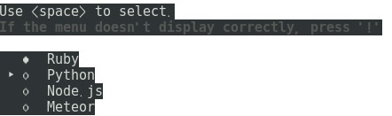
```
[기본 설정으로 진행하기 위해 모두 Enter 입력]
```
- 서버에 Passenger를 추가하기 위해 httpd.conf 파일 열기
```
# vim /usr/local/SWV/server/httpd/conf/httpd.conf
```
- 마지막에 다음 코드 추가
```
LoadModule passenger_module /usr/local/SWV/dev/ruby/lib/ruby/gems/2.5.0/gems/passenger-5.3.5/buildout/apache2/mod_passenger.so
<IfModule mod_passenger.c>
    PassengerRoot /usr/local/SWV/dev/ruby/lib/ruby/gems/2.5.0/gems/passenger-5.3.5
    PassengerDefaultRuby /usr/local/SWV/dev/ruby/bin/ruby
  </IfModule>
  <Directory "/usr/local/SWV/htdocs/redmine">
    Require all granted
    Options FollowSymLinks
    AllowOverride None
    RailsBaseURI /redmine
  </Directory>
```
- redmine 디렉터리의 권한 수정
```
# ln -s /usr/local/SWV/tools/redmine/public /usr/local/SWV/htdocs/redmine
# chown -R apache. /usr/local/SWV/htdocs/redmine
```
- 서버 재실행
```
# /bin/httpd -k restart
```
- 웹브라우저를 이용하여 Redmine 실행 확인(http://localhost/redmine 경로에 접근)
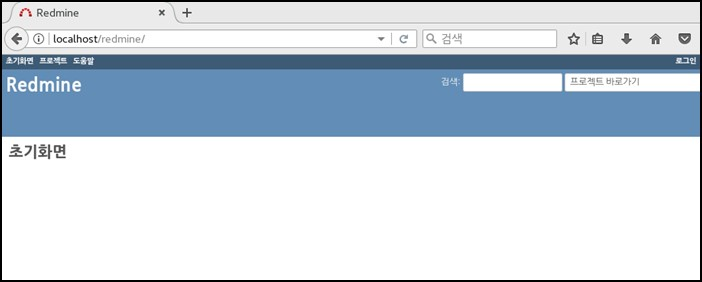


9. Subversion 설치
- Subversion와 관련 유틸리티 다운로드 후 설치
```
# mkdir /usr/local/SWV/server/svn
# cd /usr/local/SWV/server/svn
# wget https://archive.apache.org/dist/subversion/subversion-1.7.14.tar.gz
# tar -xzvf subversion-1.7.14.tar.gz
# cd subversion-1.7.14
# wget https://archive.apache.org/dist/apr/apr-util-1.3.12.tar.gz
# wget https://archive.apache.org/dist/apr/apr-1.4.5.tar.gz
# tar -xzvf apr-util-1.3.12.tar.gz
# tar -xzvf apr-1.4.5.tar.gz
# yum -y install epel-release libsqlite3x-devel.x86_64
# ./configure --prefix=/usr/local/SWV/server/svn --with-neon --with-ssl
# make
# make install
```
- bash_profile의 환경변수 수정을 위해 열기
```
# vim ~/.bash_profile
```
- 다음과 같이 코드를 수정
```
변경 전: PATH=$PATH:$HOME/bin
변경 후: PATH=$PATH:$HOME/bin:/usr/local/SWV/server/svn/bin/
```
- bash_profile 재등록
```
# source ~/.bash_profile
# svn --version
[버전 정보 출력 확인]
```


10. SourceNavigator 다운로드 후 설치
```
# cd /usr/local/SWV/dev
# mkdir SNavi
# cd SNavi
# wget https://sourceforge.net/projects/sourcenav/files/NG4.5/sourcenavigator-NG4.5.tar.bz2
# tar jxf sourcenavigator-NG4.5.tar.bz2
# cd sourcenavigator-NG4.5
# ./configure --prefix=/usr/local/SWV/dev/SNavi
# make
# make install
```


11. Graphviz 다운로드 후 설치
```
# cd /usr/local/SWV/dev
# mkdir graphviz
# cd graphviz
# wget -c http://graphviz.gitlab.io/pub/graphviz/stable/SOURCES/graphviz.tar.gz
# tar -xzvf graphviz.tar.gz
# cd graphviz-2.40.1
# ./configure
# make
# make install
```


12. Git 다운로드 후 설치
```
# mkdir /usr/local/SWV/server/git
# cd /usr/local/SWV/server/git
# yum install curl-devel expat-devel gettext-devel \
  openssl-devel zlib-devel perl-CPAN
# wget https://mirrors.edge.kernel.org/pub/software/scm/git/git-2.9.5.tar.gz
# tar -xzvf git-2.9.5.tar.gz
# cd git-2.9.5
# make prefix=/usr/local/SWV/server/git all
# make prefix=/usr/local/SWV/server/git install

# echo "export PATH=/usr/local/SWV/server/git/bin:$PATH" >> /etc/bashrc
# source /etc/bashrc
```


13. Apache Maven 다운로드 후 설치
- maven 다운로드 및 압축 해제
```
# cd /usr/local/SWV/tools
# wget http://apache.tt.co.kr/maven/maven-3/3.5.4/binaries/apache-maven-3.5.4-bin.tar.gz
# tar -xzvf apache-maven-3.5.4-bin.tar.gz
# mv apache-maven-3.5.4/ apache-maven/
```
- maven.sh 파일 열기
```
# vim /etc/profile.d/maven.sh
```
- 파일에 다음 코드를 추가
```
# Apache Maven Environment Variables
# MAVEN_HOME for Maven 1 - M2_HOME for Maven 2
export M2_HOME=/usr/local/SWV/tools/apache-maven
export PATH=${M2_HOME}/bin:${PATH}
```
- maven.sh 등록
```
# chmod +x /etc/profile.d/maven.sh
# source /etc/profile.d/maven.sh
```


14. Nexus 다운로드 후 설치
- Nexus 다운로드
```
# cd /usr/local/SWV/tools
# wget http://download.sonatype.com/nexus/3/nexus-3.13.0-01-unix.tar.gz
# tar -xzvf nexus-3.13.0-01-unix.tar.gz
# ln -s nexus-3.13.0-01 nexus
# useradd nexus
# chown -R nexus:nexus /usr/local/SWV/tools/nexus
# chown -R nexus:nexus /usr/local/SWV/tools/sonatype-work/
```
- nexus.rc 파일 열기
```
# vim /usr/local/SWV/tools/nexus/bin/nexus.rc
```
- 다음 내용 추가
```
run_as_user=”nexus”
```
- Nexus 서비스 시작
```
# ln -s /usr/local/SWV/tools/nexus/bin/nexus /etc/init.d/nexus
# cd /etc/init.d
# chkconfig --add nexus
# chkconfig --levels 345 nexus on
# service nexus start
```
- nexus.service 파일 열기
```
# vim /etc/systemd/system/nexus.service
```
- 다음과 같이 코드 추가 또는 수정
```
[Unit]
Description=nexus service
After=network.target
	
[Service]
Type=forking
ExecStart=/usr/local/SWV/tools/nexus/bin/nexus start
ExecStop=/usr/local/SWV/tools/nexus/bin/nexus stop
User=nexus
Restart=on-abort
	
[Install]
WantedBy=multi-user.target
```
- nexus 파일 열기
```
# vim /usr/local/SWV/tools/nexus/bin/nexus
```
- 다음과 같이 코드 수정
```
변경 전: # INSTALL4J_JAVA_HOME_OVERRIDE=
변경 후: INSTALL4J_JAVA_HOME_OVERRIDE=/usr/local/SWV/dev/java/jdk1.8.0_181
```
- 수정사항 적용
```
# systemctl daemon-reload
# systemctl enable nexus
# systemctl start nexus
# systemctl status nexus
# tail -f /usr/local/SWV/tools/sonatype-work/nexus3/log/nexus.log
```
- 8081포트 방화벽 해제
```
# firewall-cmd --zone=public --permanent --add-port=8081/tcp
# firewall-cmd --reload
```
- nexus-default.properties 파일 열기
```
# vim /usr/local/SWV/tools/nexus/etc/nexus-default.properties
```
- 다음과 같이 코드 수정
```
변경 전	nexus-context-path=/
변경 후	nexus-context-path=/nexus
```
- httpd.conf 파일 열기
```
# vim /usr/local/SWV/server/httpd/conf/httpd.conf
```
- 다음과 같이 코드 수정
```
변경 전:
ProxyPass /jenkins http://127.0.0.1:8080/jenkins
ProxyPassReverse /jenkins http://127.0.0.1:8080/jenkins

변경 후:
ProxyPass /jenkins http://127.0.0.1:8080/jenkins
ProxyPassReverse /jenkins http://127.0.0.1:8080/jenkins
ProxyPass /nexus http://127.0.0.1:8081/nexus
ProxyPassReverse /nexus http://127.0.0.1:8081/nexus
```
- nexus 재시작
```
# systemctl restart nexus
```


## 별첨 1
apr의 다운로드 경로가 변경되었을 경우, 경로를 찾는 방법(Windows 10 기준)
- http://mirror.apache-kr.org/apr에 접속
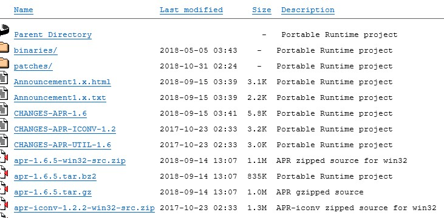
- 다운로드 받고자 하는 파일을 마우스 오른쪽 버튼으로 클릭 후 속성 선택
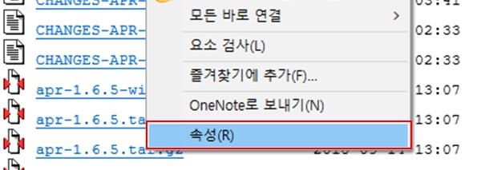
- 파일의 주소(URL)을 확인 후 해당 주소로 다운로드


## 별첨 2
JDK의 다운로드 경로가 변경되었을 경우, 경로를 찾는 방법(Windows 10 기준)
- https://www.oracle.com/technetwork/java/javase/downloads/index.html에 접속하여 JDK 다운로드 클릭
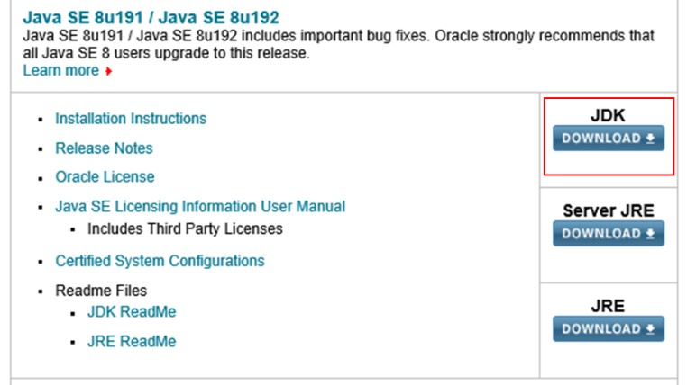
- Accept License Agreement 클릭
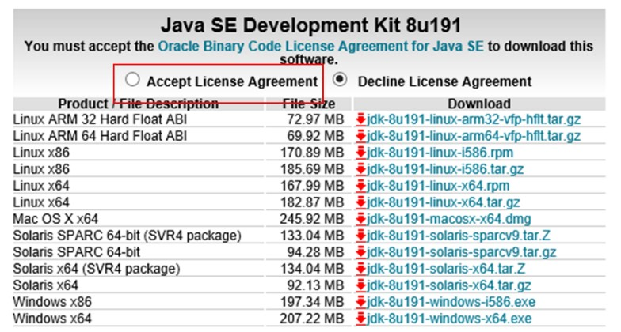
- 다운로드 받고자 하는 파일의 이름을 마우스 오른쪽 버튼으로 클릭 후 속성 선택
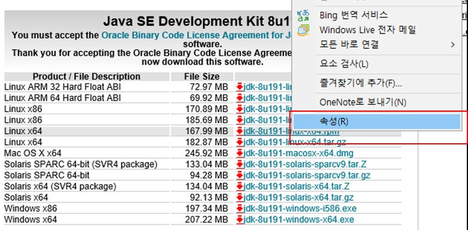
- 파일의 주소(URL)을 확인 후 해당 주소로 다운로드
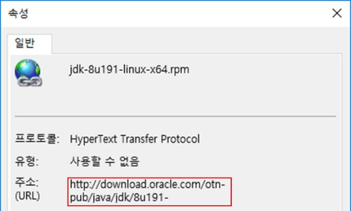
